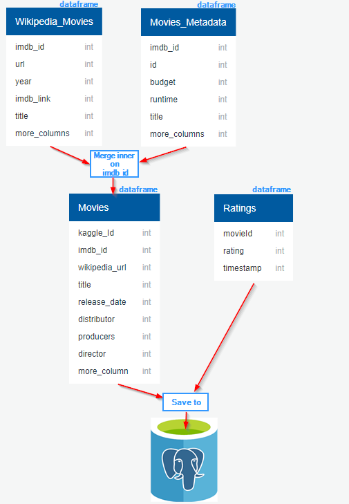

# Movies ETL

**Summary**
---

**Software:**
---
1. Download 7zip to merge and unzip data sources
   [https://www.7-zip.org/](https://www.7-zip.org/)
2. Jupyter notebook (Anaconda)
   [https://www.anaconda.com/distribution/](https://www.anaconda.com/distribution/)
3. Postgre (SQLDB)
   [https://www.postgresql.org/download/](https://www.postgresql.org/download/)

**Data source**
---
1. **Wikipedia.movies.json** after merge and unzip wikipedia.movies.zip files. This is a list of dictionary of movie, video, and tv-show.  Dictionany items are not in uniform well-form. They needs be cleaned up and normalized.
2. **Movies_metadata.csv** after merging and upzipping movies_metadata.zip files. This is a list of movies which contain extra information that wikipedia.movies do not contain.
3. **rating.csv** after merge and unzip rating.zip files. This is a largest file in all three files. It is a list of rating movies by users. This is the most well-form data file among 3 three files.

**ETL Process Overview**
---
**Wikipedia.movies** (extract ***imdb_id***)<-inner->(***imdb_id***)**Movies_metadata**(id or (***kaggle_id***)<-left->(**id**) **rating**

**ETL Process**
---
Assumption is Wikipedia.movies.json, Movies_metadata.csv, and rating.csv good files and good data for file extensions.

Data strategy:

- Wikipedia.movies.json: (This will merge with Movies_Metadata)
   
   1. Load the file to object with JSON module function. Assumption JSON return a list of dictionary movie object.
   2. Filter only movies from the list 
   3. Transform movies into the uniform well-form dictionary movie objects
   4. Load to the list of movies to Panda dataframe
   
- Movies_metadata.csv: (This will merge with  Wikipedia.movies)
   1. Load to Panda dataframe with build-in function

- rating.csv: (Load to Postgre database) 
   1. Load to Panda dataframe with build-in function
   2. Connection database and save dataframe to database table
   
